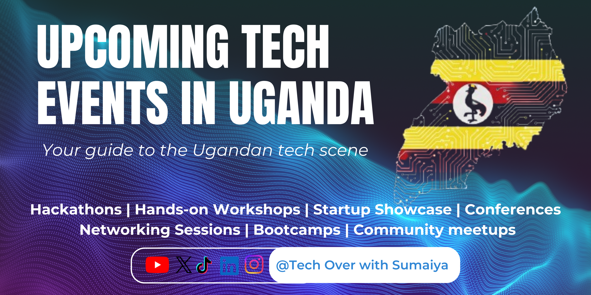

## 2026 Tech events in Uganda
Welcome to the centralized hub for all things tech in Uganda. This repository is a community-driven directory of upcoming conferences, meetups, hackathons, and workshops across the country.

## Why this exists?

Social media feeds move fast, and important events often get buried. This repository serves as a permanent, searchable, and collaborative record to ensure no developer or tech enthusiast in Uganda misses out on growth opportunities.

Every link in this repository includes a date when a particular event will be happening alongside the venue. The events are arranged according to months

## To get the most out of this directory, do this:
- Browse the whole list by scrolling down to the Upcoming events section to see a chronological list of  the tech gatherings
- Get the details by clicking on the link attached on each particular event to access the official registration page, agenda, and venue details.
- Stay updated by clicking the star button at the top of this page to save this repository in your favorites and check back regularly for new additions.

## How to contribute:
- Found an event i missed? Please help the community by forking this repository.
- Add the event details (Please ensure you follow the existing format).
- Submitting a pull request.

If you find this directory helpful, please consider giving it a star and feel free to share it with other techies.
